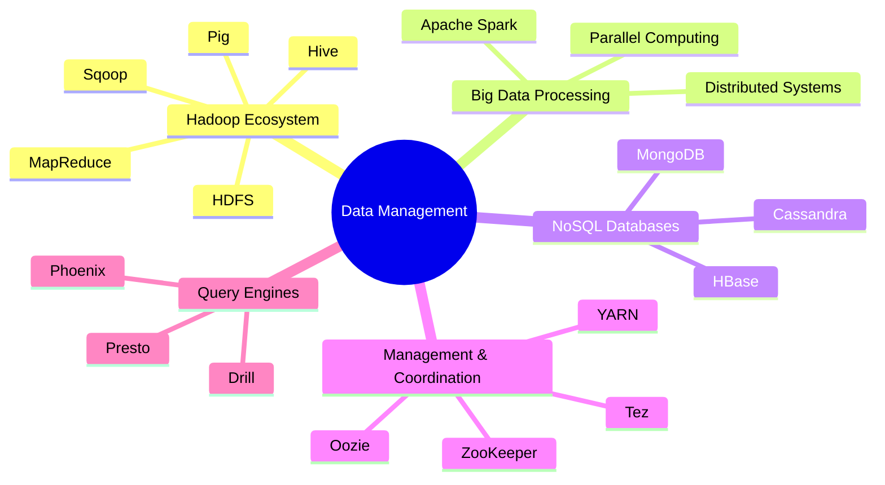

<div align="center">

#  STQD6324: Data Management

-blue?style=for-the-badge)


> A comprehensive course covering modern data management technologies, distributed systems, big data processing frameworks, and NoSQL databases.

</div>


## Course Information

| Item | Details |
|--------|---------|
| Course Code | STQD6324 |
| Course Name | Data Management |
| Credit Hours | 4 |
| Semester | Semester 2, 2025/2026 |
| Lecturer | Dr. Bernard Lee Kok Bang |
| Department | Department of Mathematical Sciences, FST, UKM |

---

##  Assessment Structure

- [x] Quiz
- [x] [Assignment 1](https://github.com/wainins/STQD6324_Data_Management/tree/main/Assignment1_Iris_Classification) 
- [ ] Assignment 2 
- [ ] Final Report

### Overall Progress

```text
██████████░░░░░░░░░░ 50%
```

---

##  Technologies Covered


---

##  Repository Structure

```text
STQD6324_Data_Management/
│
├── README.md
│
└── Assignment1_Iris_Classification/
    ├── Title.png/
    ├── iris_classification_pyspark.ipynb/
    └── iris_setosa.png/
    └── iris_verginica.png/
    └── iris_versicolor.png/
```

---

##  License

This repository is intended for educational and academic purposes under:

**STQD6324 – Data Management**  
Department of Mathematical Sciences  
Faculty of Science and Technology (FST)  
Universiti Kebangsaan Malaysia (UKM)
